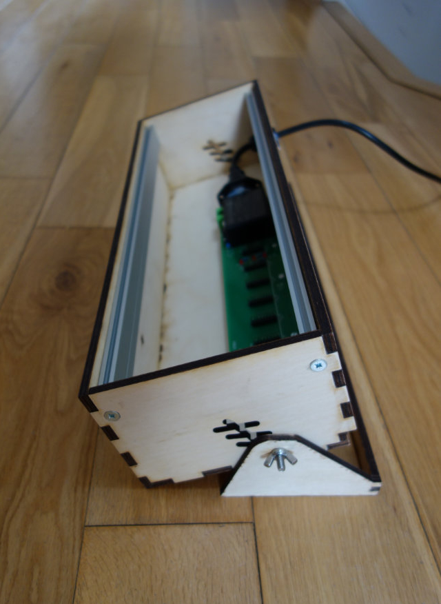

## Tiltable Eurorack Case

This is an 84HP 3U Eurorack case, designed in Autodesk Fusion 360 for laser cutting using 6mm plywood.  

The stand for tilting can be removed or can be set to 0 degree tilt. See example images.
  
This unit has an internal depth of 93mm. Check the depth of your Eurorack modules before building! 

Included are:

- The original Fusion 360 file in .f3d format
- DXF files which were exported to **include kerf compensation of 0.25mm**
- SVG files which were created from the exported DXF files and can be used for laser cutting

The Fusion 360 plugin [DXF for Laser](https://apps.autodesk.com/FUSION/en/Detail/Index?id=7634902334100976871) was used for kerf compensation.  
If you want to change the kerf compensation settings to suit your laser cutter, you will need to open the original .f3d file and re-export the DXFs with the appropriate setting.  
 

## Rails

The case was designed to use [SynthRacks](https://synthracks.com/shop/eurorack-mounting-rails) rails, but others should work OK. Note that there are no pre-drilled holes for rails. You are recommended to buy a pair of Synthracks' [Side Cheeks](https://synthracks.com/shop/eurorack-side-cheeks) and use them to mark out the case for drilling.

## Notes

The tilting mechanism requires two M5 bolts with wing nuts.  

The back panel of the case was designed to accomodate a cable grip for power (see example images) and a midi connector. There is an engraved hexagon for fitting the plastic nut of the cable grip. You will probably want to edit the back panel to suit your power connector.

## License

 This work is licensed under a <a rel="license" href="http://creativecommons.org/licenses/by-nc-sa/3.0/">Creative Commons Attribution-NonCommercial-ShareAlike 3.0 Unported License</a>.
That means that you're free to use the project with attribution, except for commercial purposes, and you should share any remixes or modifications using the same license.
